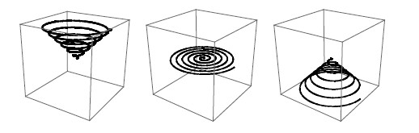



## Fractal \- Archimed spiral

### Description

Archimedean spiral - the simplest fractal (lesson 1)

Archimedean spiral is applied in the construction of various tools such as slotting cutters, in centrifugal pumps, fans, bumper rail ...

It is interesting how Archimedes explained the rules of formation of his spiral. The ruler is fixed at some point - let's call it point A. Suppose that when the ruler starts to rotate around point A, an ant start to walk away from point A. The ant would describe the "real" geometric spiral which is obtained by combining two moving trends - rotation around a point and translation along the ruler.

And fractal - the principal determinant of the fractal self-similarity. It could be said to consist of copies of itself in different scales. Actually it is a bit more complicated but for this example it will do fine enough.

I have not seen simpler example of fractal anywhere.
 
### More Info
 

             |
---                |---
**Submitted On**   |2011-03-15 14:30:02
**By**             |[Dolac](https://github.com/Planet-Source-Code/PSCIndex/blob/master/ByAuthor/dolac.md)
**Level**          |Beginner
**User Rating**    |5.0 (10 globes from 2 users)
**Compatibility**  |VB 5\.0, VB 6\.0
**Category**       |[Math/ Dates](https://github.com/Planet-Source-Code/PSCIndex/blob/master/ByCategory/math-dates__1-37.md)
**World**          |[Visual Basic](https://github.com/Planet-Source-Code/PSCIndex/blob/master/ByWorld/visual-basic.md)
**Archive File**   |[Fractal\_\-\_2199843152011\.zip](https://github.com/Planet-Source-Code/dolac-fractal-archimed-spiral__1-73799/archive/master.zip)

